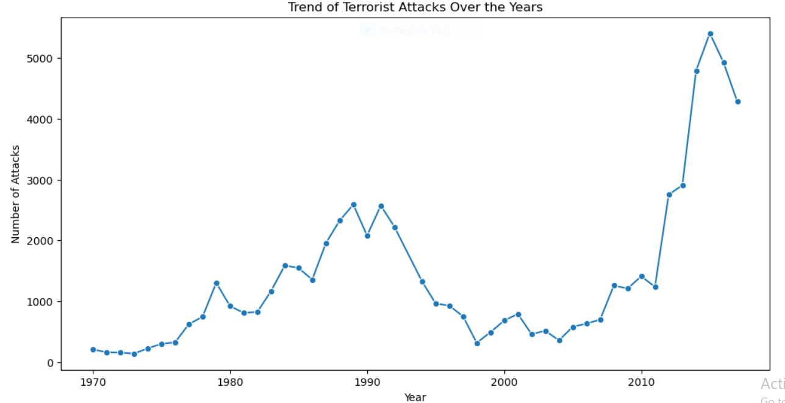
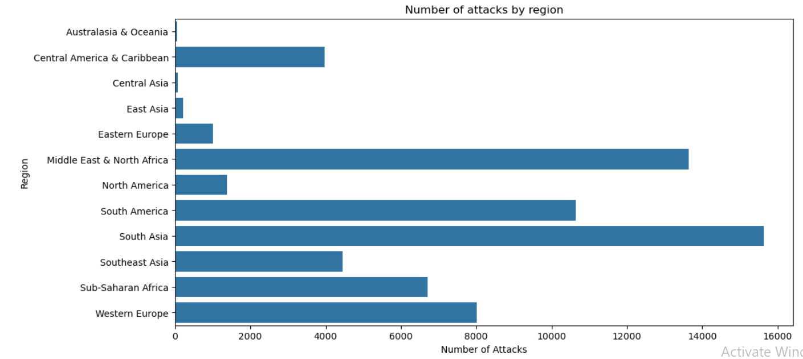
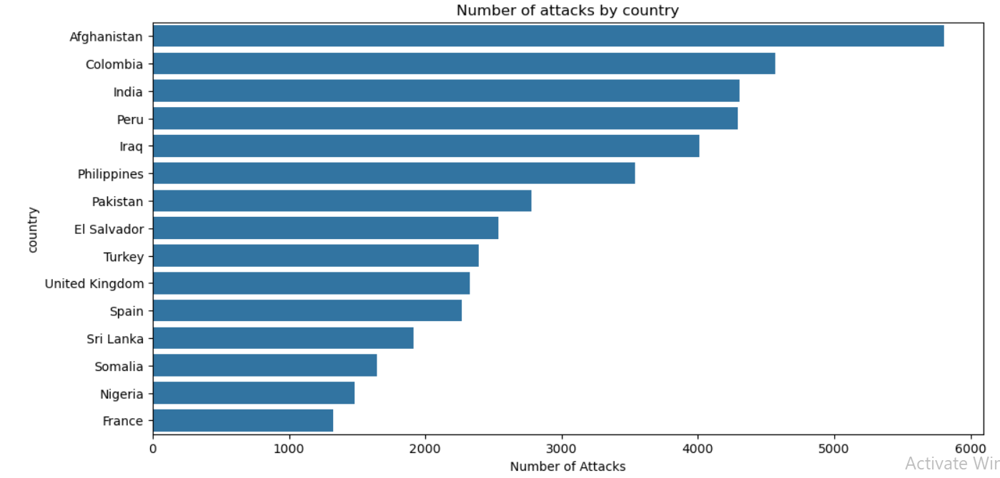
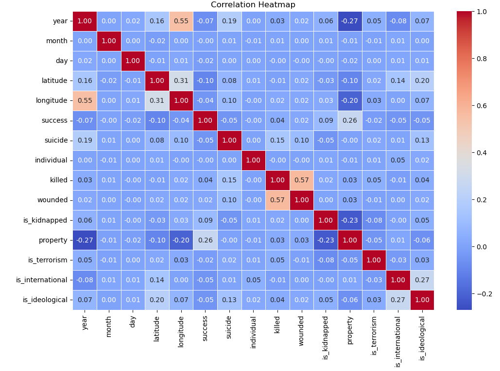
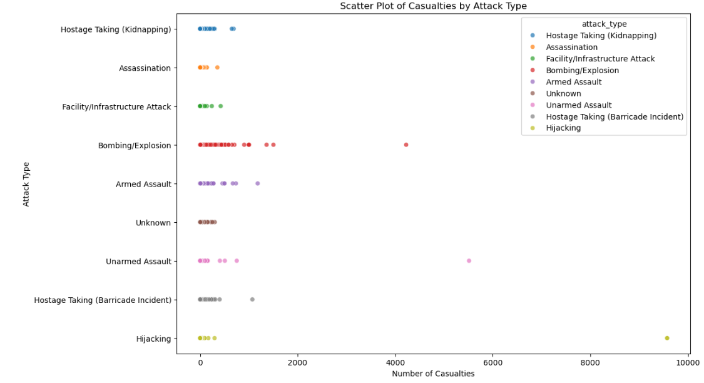
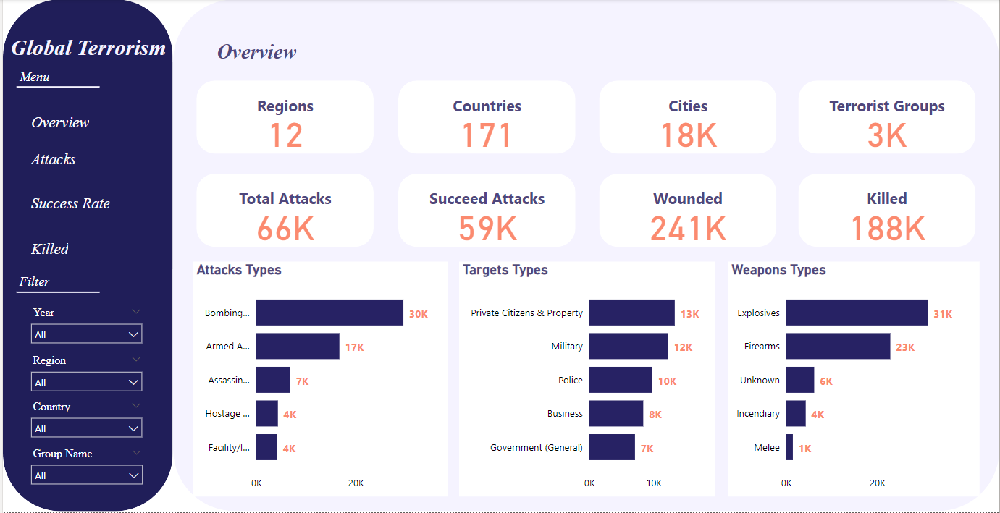
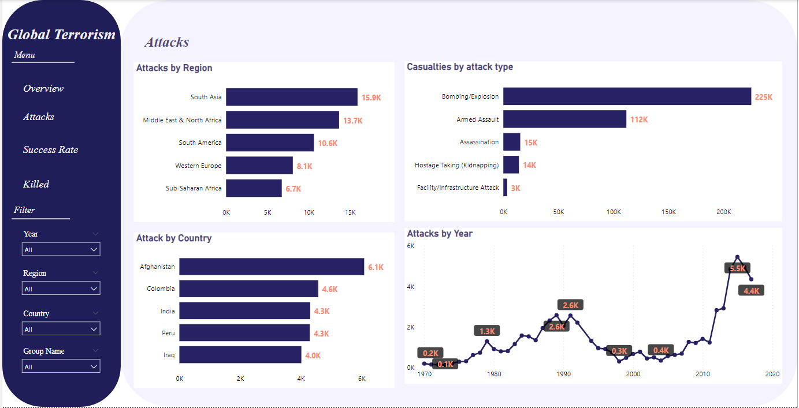
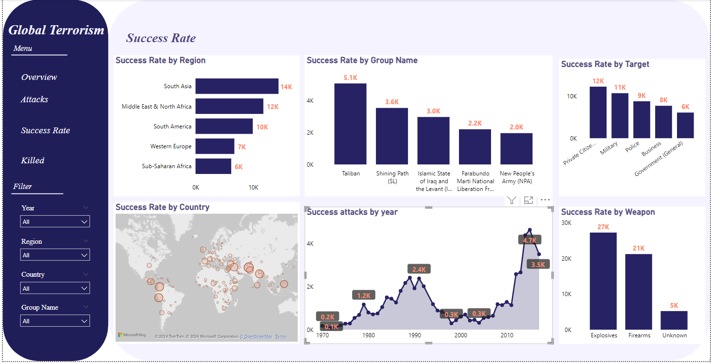
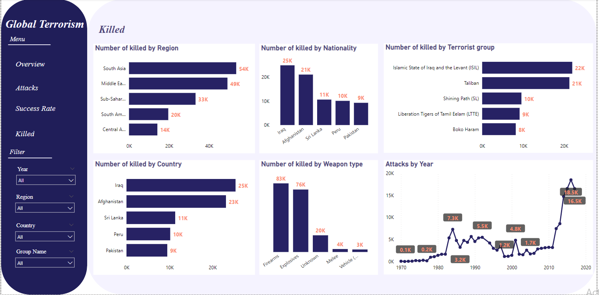

# Global-Terrorism-Dataset-Analysis
This repository contains an analysis of the Global Terrorism Dataset and a dashboard visualizing the findings.
The project was completed using Jupyter Notebook and includes data acquisition, preprocessing, analysis, and visualization.

# Project Overview
This project aims to analyze global terrorism incidents using the Global Terrorism Dataset.
The analysis includes data preprocessing, statistical analysis, and visualization to identify trends,
most affected regions, attack types, and more.
The project also includes a performance comparison between Pandas and Dask for handling large datasets.

# Project Structure
- `Global_Terrorism_updated.ipynb/`: Jupyter notebooks containing the analysis and visualizations.
- `global terrorism_Dashboard_updated.pbix/`: Files related to the dashboard visualization.
- `Global_Terrorism_Cleaned_Updated.xls/`: The cleaned dataset used for analysis.
- `Report_Updated.pdf/`: The PDF report summarizing the findings from the analysis.

# Analysis and Findings
The analysis covers several aspects of the dataset, including:

## Most Frequent Values in Categorical Columns:
- Most afected region: South Asia
- Most affected country: Afghanistan
- Most attack type used: Bombing/Explosion
- Most Weapon type used: Explosives
- Most terrorist group: Taliban
- Most affected target: Private Citizens & Property
  
## Most Frequent Values in Numeric Columns:
Most frequent year for attacks: 2015

# Key Visualizations

## Line plot showing the trend of terrorist attacks over the years.
- The line plot shows that the terrorist attacks increased after 2010
  

## Bar plot of the number of attacks by region and by country.
- The bar plot shows that the terrorist attacks are high in South Asia then in Middle East & North Africa
  

## Bar plot of the number of attacks by country
- The bar plot shows that the terrorist attacks are the highest in Afghanstan

  

## Heatmap to visualize correlations between different features.

## Scatter plot showing the relationship between the number of casualties and the type of attack.
- Scatter plot shows that Bombing/Explosive has a high number of casualties

  
  
# Dashboard

The dashboard provides an interactive way to explore the dataset and visualize the findings. 
It includes:
- Overview Page

  

  
- Attackes Page: It describes number of attacks by region, country, year, attack type.

  
  

  
- Success Rate Page: It describes Success rate of attacks by region, country, year, group name, target, weapon.

  
  

  
- Killed Page: It describes number of killed by region, country, year, nationality, group name, weapon.

  

# Installation

To run the notebooks or dashboard locally, you'll need the following Python libraries:
- Pandas
- Numpy
- Dask
- Matplotlib
- Seaborn
- Power BI to open the dashboard
